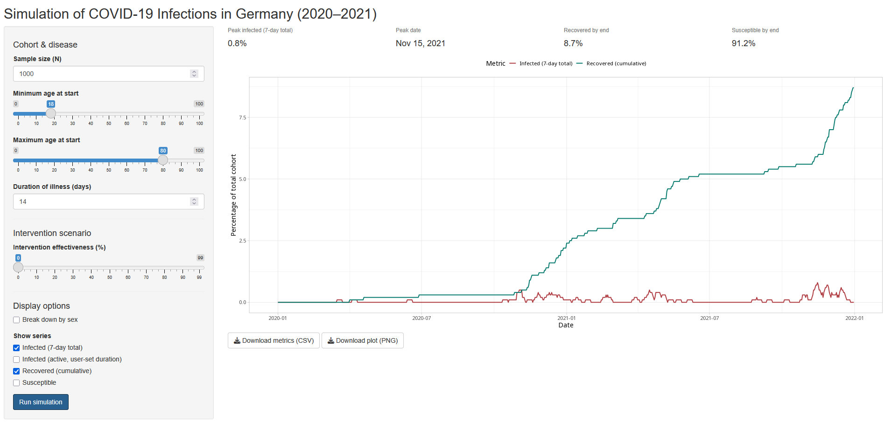

# Scenario-Based Projection Tool for Pandemic Spread

## Overview

This is the repository for the scenario-based projection tool concerning the impact of pandemic spread. The tool is developed within the Leibniz Lab for Pandemic Preparedness by the team at DIW (Alex Lepe and Sabine Zinn).

## Repository contents

-   app.R - Shiny tool for the simulation
-   00_prepping_rki_data.qmd - Code to load and clean the RKI data
-   00_prepping_rki_data.html - Rendered HTML of the quarto file
-   data/
    -   SurvStat_complete_data.csv - All the processed data
    -   SurvStat_female_data.csv - Processed data for females
    -   SurvStat_male_data.csv - Processed data for males
    -   weekly - Folder with all the raw weekly data files from [SurvStat\@RKI](mailto:SurvStat@RKI){.email}
-   shinycovid-simulation.png – Screenshot used in documentation
-   README.md - Description of the project
-   ProjectionPandemicIncidence.Rproj - R project file

## Running the tool

### Prerequisites

Ensure the following packages are installed: `shiny`, `shinyBS`, `here`, `MicSim`, `readr`, `data.table`, and `tidyverse`

### Running the tool

From the project root run:

``` r
shiny::runApp("app.R")
```

Adjust the sliders in the left-hand panel and click **Run simulation**. **Note:** larger values of **N** (cohort size) increase runtime.

If you run the tool with **all default settings**, the output should match the screenshot 

## How the projection tool works

1.  Import infection rates: Weekly SARS‑CoV‑2 infection rates for 2020–2021 are read from `data/weekly/` (source: Robert Koch Institute – SurvStat\@RKI 2.0).
2.  Generate a synthetic cohort: `N` individuals are sampled with uniform ages between the user‑chosen age range and the sample is evenly split by sex.
3.  Microsimulation (using MicSim): Each individual can move through the states `Susceptible → Infected → Recovered`
    -   Transition rates are scaled by `1 – (intervention effectiveness / 100)`, which is defined by the user.
    -   The amount of time spent being ill is also defined by the user.
    -   For more details on how MicSim’s simulation engine works, see the [CRAN documentation](https://cran.r-project.org/web/packages/MicSim/index.html).
4.  Post‑processing: Getting daily counts for
    -   active infections (14‑day rolling sum),
    -   total number of people recovered from illness
    -   remaining number of people susceptible to infection
5.  Visualisation: The Shiny UI plots the percentage of people actively infected and recovered per day.
